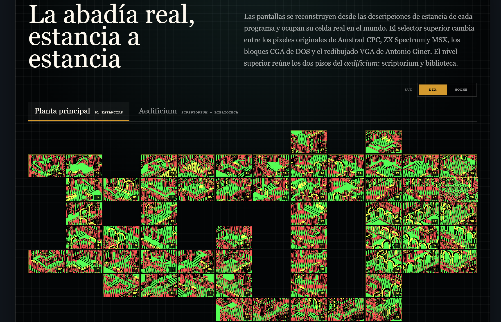
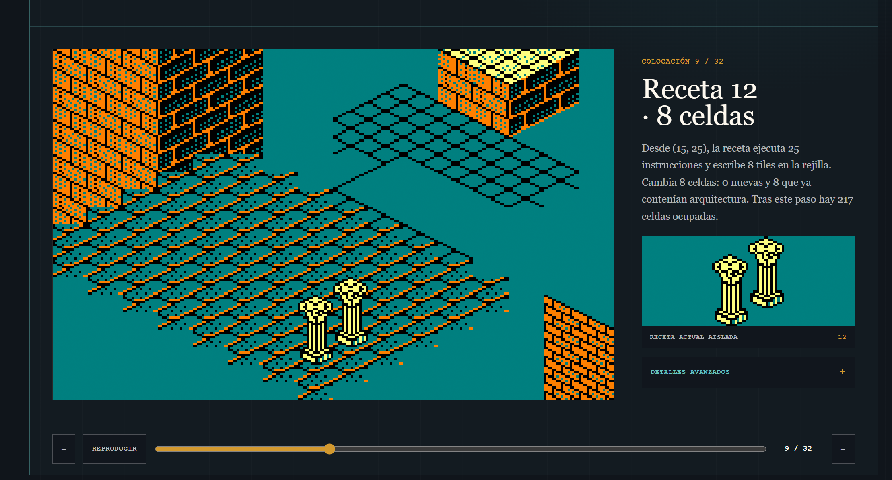
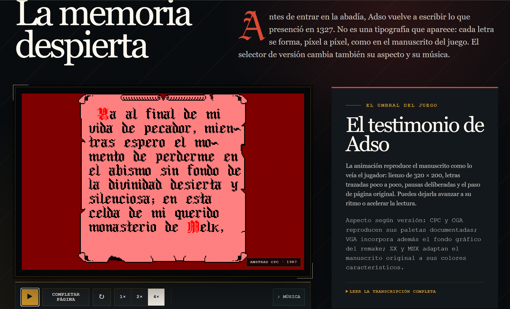
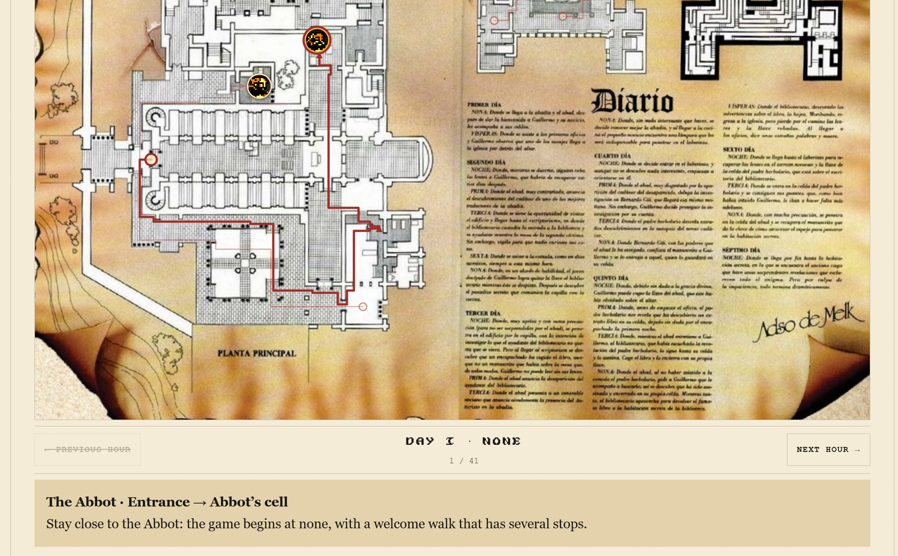
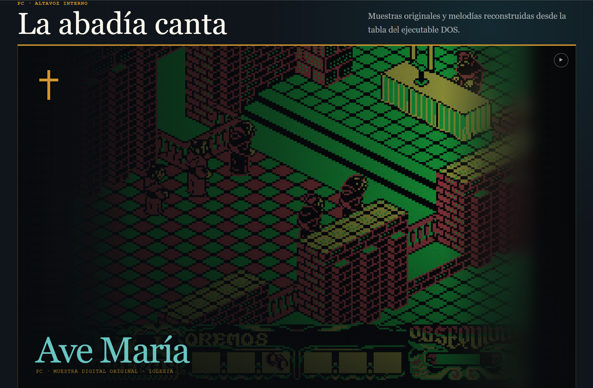
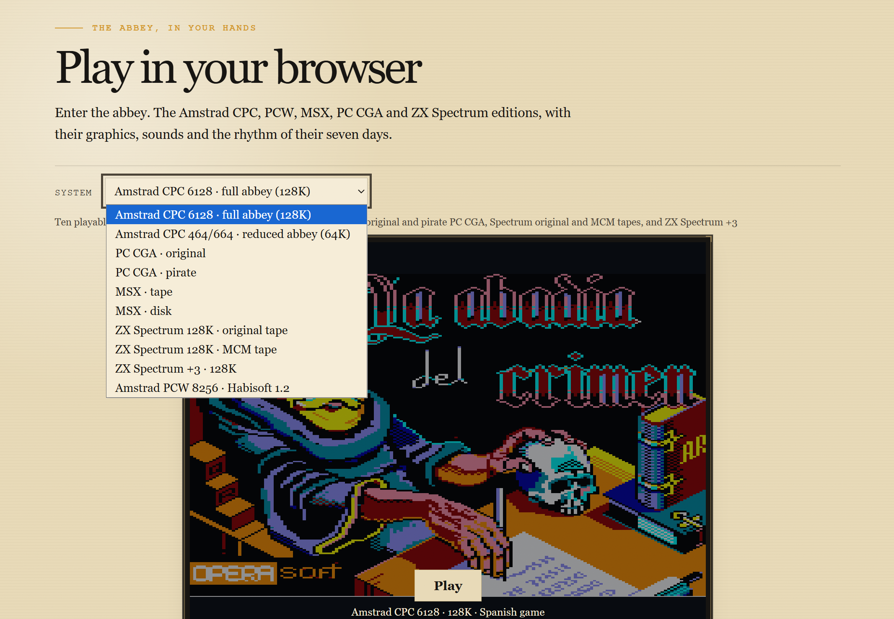
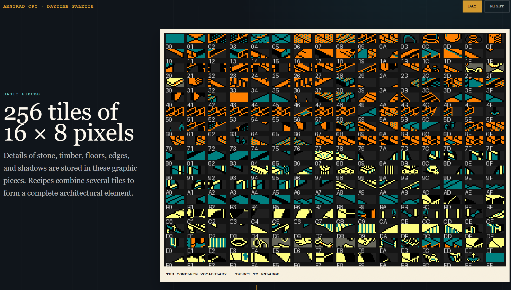
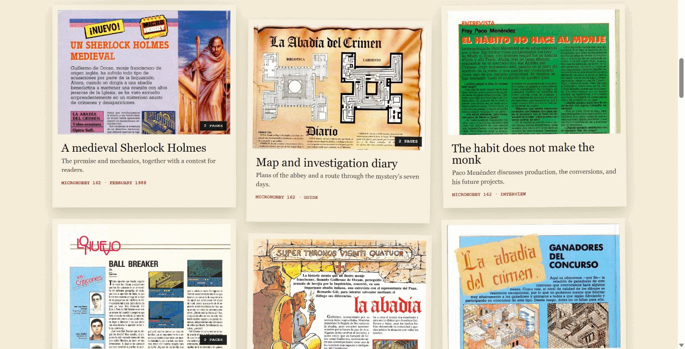

# Homenaje a La Abadía del Crimen

Archivo visual bilingüe e interactivo dedicado al clásico de Paco Menéndez y Juan Delcán.

A bilingual, interactive visual archive devoted to the classic game by Paco Menéndez and Juan Delcán.

**[Español](#español) · [English](#english) · [Abrir el homenaje / Open the tribute](https://andresdelcampo.github.io/HomenajeLaAbadiaDelCrimen/)**


## Dentro de la experiencia / Inside the experience



*La abadía real, estancia a estancia / The real abbey, room by room*



*Una estancia de principio a fin / One room from beginning to end*



*Los pergaminos vuelven a escribirse / The manuscripts write themselves again*



*Cada personaje, día a día y hora a hora: 41 momentos documentados / Every character, day by day and hour by hour: 41 documented moments*



*Ave María y los sonidos de la abadía / Ave Maria and the sounds of the abbey*

## Español

Este homenaje no se limita a contar la historia de *La Abadía del Crimen*: permite recorrerla, escucharla y desmontarla pieza a pieza. Reúne el juego, sus creadores, sus versiones, la arquitectura de la abadía, los personajes y sus rutinas, los siete días de la investigación, el sonido, la prensa, la arqueología del código y su legado en una experiencia editorial concebida para explorar.

### Qué puedes hacer (abre cada sección para saber más)

- <details>
  <summary><strong>Jugar en el navegador.</strong> Diez ediciones preservadas, cargadas directamente en tu navegador.</summary>

  

  <ul>
    <li>Amstrad CPC 6128 · abadía completa (128K)</li>
    <li>Amstrad CPC 464/664 · abadía reducida (64K)</li>
    <li>PC CGA · original</li>
    <li>PC CGA · pirata</li>
    <li>MSX · cinta</li>
    <li>MSX · disco</li>
    <li>ZX Spectrum 128K · cinta original</li>
    <li>ZX Spectrum 128K · cinta MCM</li>
    <li>ZX Spectrum +3 · 128K</li>
    <li>Amstrad PCW 8256 · Habisoft 1.2</li>
  </ul>

  Cada disco o cinta se carga automáticamente y el reproductor incluye pausa, silencio, reinicio y pantalla completa. Está pensado para ordenadores con teclado; el juego está en español y la partida no se guarda al cerrar o recargar la página. La edición CPC de 64K se ejecuta mediante la emulación compatible de CPC 6128 en RVMPlayer.
  </details>

- <details>
  <summary><strong>Recorrer la abadía.</strong> Las 93 estancias aparecen en su lugar real: explora plantas, luz y versiones.</summary>

  

  El atlas sitúa 93 estancias en su posición real: 61 en la planta principal, 16 en el scriptorium y 16 en la biblioteca. Puedes abrir cualquiera a tamaño completo, desplazarte espacialmente a las contiguas con teclado, controles en pantalla o gestos, alternar día y noche y comparar CPC, ZX Spectrum, MSX, PC CGA y el remake PC VGA. El mapa ampliado de *Extensum* añade 140 estancias cartografiadas, distribuidas por plantas y explorables de día y de noche.
  </details>

- <details>
  <summary><strong>Ver nacer una estancia.</strong> Sigue sus 32 colocaciones y el viaje de cada píxel hasta la pantalla.</summary>

  

  La demostración interactiva de la estancia 17 reproduce sus 32 colocaciones una a una, aísla la receta arquitectónica activa y explica qué teselas gráficas (tiles) y celdas modifica. Una segunda fase sigue la copia documentada de las 320 celdas visibles a la pantalla CGA. Todo puede avanzarse manualmente o reproducirse, de día y de noche.
  </details>

- <details>
  <summary><strong>Leer los pergaminos.</strong> Cada letra aparece trazo a trazo, con sus pausas y su música.</summary>

  

  No son textos que simplemente aparecen: cada letra se traza píxel a píxel, con sus pausas y pasos de página. Los controles permiten reproducir, pausar, completar la página, reiniciar y cambiar la velocidad. La versión gráfica seleccionada transforma el manuscrito y activa su música correspondiente en CPC, ZX Spectrum, MSX, PC CGA o VGA.
  </details>

- <details>
  <summary><strong>Seguir los siete días.</strong> 41 momentos documentados, personajes en movimiento y secretos protegidos por spoilers.</summary>

  

  El explorador recorre 41 momentos desde nona del día I hasta tercia del VII. Primero ofrece una crónica sin spoilers; después permite abrir las pistas, los sucesos, qué hacer y los diálogos correspondientes. El mapa sitúa a los ocho personajes y muestra sus desplazamientos esperados entre horas o dentro de escenas documentadas, con retratos seleccionables, orígenes, destinos y estados de presencia. Es una lectura editorial de la lógica reconstruida del juego —no un emulador ni una repetición de una partida— y señala cuándo los encuentros pueden variar por cercanía, inventario o acciones anteriores.
  </details>

- <details>
  <summary><strong>Escuchar la abadía.</strong> <em>Ave María</em>, la acusación «pirata», pasos, efectos y la huella sonora de cada máquina.</summary>

  

  El archivo sonoro permite reproducir la muestra digital original de *Ave María* del PC, la acusación «pirata», melodías reconstruidas desde el ejecutable DOS, pasos y efectos, además de recreaciones del sonido del Amstrad CPC conservado por Vigasoco.
  </details>

- <details>
  <summary><strong>Entender el motor.</strong> Del mundo de coordenadas a la piedra isométrica: teselas, máscaras, capas y luz.</summary>

  

  Las descripciones recuperadas de 116 estancias, 2.497 colocaciones arquitectónicas, 87 recetas y 256 teselas explican cómo una posición del mundo termina convertida en una pantalla isométrica. El recorrido continúa por máscaras, capas de profundidad, paletas, iluminación, objetos, puertas, rutas, estados de los personajes y trucos de cámara.
  </details>

- <details>
  <summary><strong>Investigar el legado.</strong> Versiones, fuentes, prensa, remakes y <em>Extensum</em>, reunidos en un archivo vivo.</summary>

  

  Ocho personajes con agendas propias, objetos y llaves, Obsequium, mapas, laberinto, cronología, adaptaciones, publicidad, prensa española y británica, reconstrucciones técnicas y el legado de una obra irrepetible.
  </details>

### Seis rutas, incluida una guía técnica

| Ruta | Qué encontrarás |
| --- | --- |
| [Historia](es/index.html) | Paco Menéndez, Juan Delcán, el origen del proyecto, las adaptaciones y su compleja historia editorial. |
| [El juego](es/juego.html) | Pergaminos interactivos, personajes, objetos, siete jornadas con cronología hora a hora, mapas y el atlas completo de estancias. |
| [Programación](es/tecnica.html) | Versiones, sonido, *Ave María*, protección anticopia, inteligencia de los personajes y acceso a la guía gráfica completa. |
| [Guía del motor gráfico](es/graficos.html) | De coordenadas, descripciones y recetas a teselas, capas, máscaras y la construcción interactiva de una estancia. |
| [Prensa y anuncios](es/prensa.html) | Publicidad y páginas históricas españolas y británicas, examinables con el visor y sus controles de zoom. |
| [Legado](es/legado.html) | Recuperaciones, remakes, influencia, preservación y memoria del juego. |

La cabecera mantiene la versión gráfica elegida mientras cambias de ruta. Pantallas, personajes, objetos, indicador de Obsequium, atlas, materiales técnicos y pergaminos responden a esa selección. La edición española y la inglesa son recorridos completos e independientes.

## English

This tribute does more than tell the story of *La Abadía del Crimen*: it lets you walk through it, listen to it, and take it apart piece by piece. The game, its creators and ports, the abbey’s architecture, character routines, the seven-day investigation, sound, contemporary press, code archaeology, and its legacy all meet in an editorial experience designed for exploration.

### What you can do (open each section to learn more)

- <details>
  <summary><strong>Play in your browser.</strong> Ten preserved editions, loaded directly in your browser.</summary>

  

  <ul>
    <li>Amstrad CPC 6128 · full abbey (128K)</li>
    <li>Amstrad CPC 464/664 · reduced abbey (64K)</li>
    <li>PC CGA · original</li>
    <li>PC CGA · pirate</li>
    <li>MSX · tape</li>
    <li>MSX · disk</li>
    <li>ZX Spectrum 128K · original tape</li>
    <li>ZX Spectrum 128K · MCM tape</li>
    <li>ZX Spectrum +3 · 128K</li>
    <li>Amstrad PCW 8256 · Habisoft 1.2</li>
  </ul>

  Each disk or tape loads automatically, and the player provides pause, mute, restart, and full screen. It is designed for computers with a keyboard; the game is in Spanish, and progress is not saved when you close or reload the page. The 64K CPC edition runs through the compatible CPC 6128 emulation in RVMPlayer.
  </details>

- <details>
  <summary><strong>Walk the abbey.</strong> All 93 rooms in their real positions—explore floors, light, and versions.</summary>

  

  The atlas places 93 rooms in their real positions: 61 on the main floor, 16 in the scriptorium, and 16 in the library. Open any room at full size, move spatially to its neighbours with the keyboard, on-screen controls, or gestures, switch between day and night, and compare CPC, ZX Spectrum, MSX, PC CGA, and the PC VGA remake. The expanded *Extensum* map adds 140 mapped rooms across its floors, explorable by day and night.
  </details>

- <details>
  <summary><strong>Watch a room take shape.</strong> Follow its 32 placements and every pixel’s journey to the screen.</summary>

  

  The interactive room-17 demonstration replays all 32 placements, isolates the active architectural recipe, and explains which tiles and cells it changes. A second phase follows the documented transfer of all 320 visible cells to the CGA screen. Step through it manually or press play, by day or by night.
  </details>

- <details>
  <summary><strong>Read the manuscripts.</strong> Every letter appears stroke by stroke, with its pauses and music.</summary>

  

  These are not blocks of text that simply appear: every letter is drawn pixel by pixel, with the original pauses and page turns. Play, pause, complete a page, restart, or change speed. The selected graphical version transforms the manuscript and supplies its matching CPC, ZX Spectrum, MSX, PC CGA, or VGA music.
  </details>

- <details>
  <summary><strong>Follow seven days.</strong> 41 documented moments, moving characters, and spoiler-gated secrets.</summary>

  

  The explorer covers 41 moments from none on day I to terce on day VII. It begins with a spoiler-free chronicle, then lets you open the clues, events, suggested actions, and relevant dialogue. The map places all eight characters and shows their expected movements between hours or across documented scenes, with selectable portraits, origins, destinations, and presence states. This is an editorial reading of the reconstructed game logic—not an emulator or recorded playthrough—and it identifies encounters that may change with proximity, inventory, or earlier actions.
  </details>

- <details>
  <summary><strong>Hear the abbey.</strong> <em>Ave Maria</em>, the “pirata” accusation, footsteps, effects, and each machine’s sonic fingerprint.</summary>

  

  The sound archive plays the PC version’s original digital *Ave Maria* sample, the “pirata” accusation, melodies reconstructed from the DOS executable, footsteps and effects, alongside recreations of the Amstrad CPC sound preserved by Vigasoco.
  </details>

- <details>
  <summary><strong>Understand the engine.</strong> From world coordinates to isometric stone: tiles, masks, layers, and light.</summary>

  

  The 116 recovered room descriptions, 2,497 architectural placements, 87 recipes, and 256 tiles show how a position in the world becomes an isometric screen. The journey continues through masks, depth layers, palettes, lighting, objects, doors, routes, character states, and camera tricks.
  </details>

- <details>
  <summary><strong>Investigate the legacy.</strong> Versions, sources, press, remakes, and <em>Extensum</em>—all in one living archive.</summary>

  

  Eight characters with schedules of their own, objects and keys, Obsequium, maps, the labyrinth, chronology, adaptations, advertising, Spanish and British press, technical reconstructions, and the legacy of a singular game.
  </details>

### Six routes, including a technical guide

| Route | What you will find |
| --- | --- |
| [History](en/index.html) | Paco Menéndez, Juan Delcán, the project’s origins, its adaptations, and its complex publishing history. |
| [The game](en/game.html) | Interactive manuscripts, characters, objects, seven days with an hour-by-hour chronology, maps, and the complete room atlas. |
| [Programming](en/technology.html) | Versions, sound, *Ave Maria*, copy protection, character intelligence, and entry to the complete graphics guide. |
| [Graphics engine guide](en/graphics.html) | From coordinates, descriptions, and recipes to tiles, layers, masks, and the interactive construction of a room. |
| [Press & adverts](en/press.html) | Spanish and British advertising and historical pages, viewable with the built-in zoomable reader. |
| [Legacy](en/legacy.html) | Recoveries, remakes, influence, preservation, and the game’s living memory. |

The header keeps the selected graphical version as you move between routes. Screens, characters, objects, the Obsequium display, room atlas, technical material, and manuscripts all respond to that choice. The Spanish and English editions are complete, independent journeys.

## Abrir localmente / Run locally

El sitio se distribuye como archivos estáticos: no hay backend ni servicio de juego en el servidor. Los emuladores son código JavaScript/WebAssembly que se ejecuta en el navegador y carga desde el propio sitio los motores y medios preservados. Desde la raíz del repositorio:

The site is distributed as static files: there is no backend or server-side game service. The emulators are JavaScript/WebAssembly running in the browser and loading the preserved engines and media from the site. From the repository root:

```powershell
python -m http.server 8765 --bind 127.0.0.1
```

Abre / Open: `http://127.0.0.1:8765/`

Para probarlo localmente, sirve la carpeta por HTTP con el comando anterior; abrir los archivos directamente con `file://` puede impedir que se carguen los módulos o el código WebAssembly.

No requiere instalar el proyecto, compilarlo, usar una base de datos ni conectar con servicios externos.

To test locally, serve the folder over HTTP with the command above; opening files directly with `file://` can prevent modules or WebAssembly from loading.

No project installation, build step, database, or external service is required.

## Derechos y créditos / Rights and credits

**Autor / Author:** Andrés del Campo Novales · con GPT 5.6 y 6 / with GPT 5.6 and 6

**Revisión técnica — versión previa (5 sept. 2026) / Technical review — prior version (Sept. 5, 2026):** Rafael Corrales Pulido · Manuel Pazos · Jesús Martínez del Vas · José Manuel Braña Álvarez

Homenaje cultural no oficial y sin fines comerciales. Las fuentes y los créditos detallados figuran al final de ambas ediciones. Los gráficos del juego, capturas, páginas de revista, mapas, audio, marcas y demás materiales de terceros pertenecen a sus respectivos titulares y no quedan sometidos a una licencia general del repositorio.

Unofficial, non-commercial cultural tribute. Detailed sources and credits appear at the end of both editions. Game graphics, screenshots, magazine pages, maps, audio, trademarks, and other third-party materials remain the property of their respective rights holders and are not covered by a repository-wide license.

Consulta / See [RIGHTS.md](RIGHTS.md).
