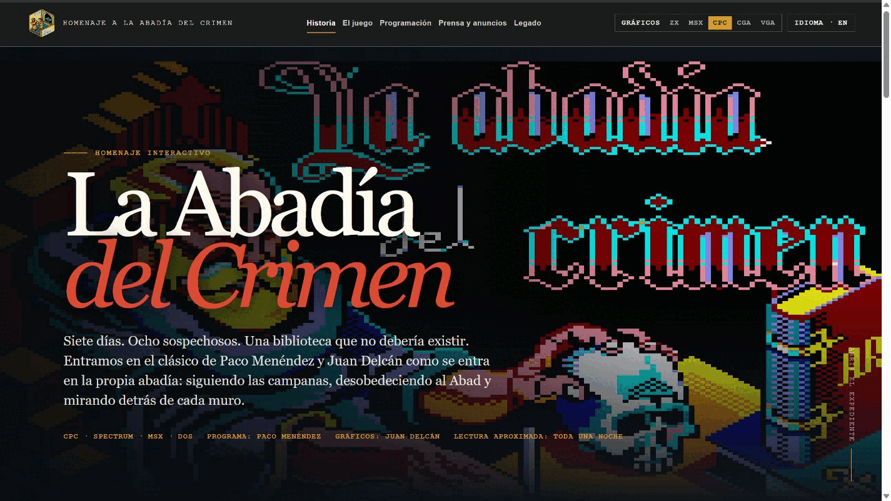
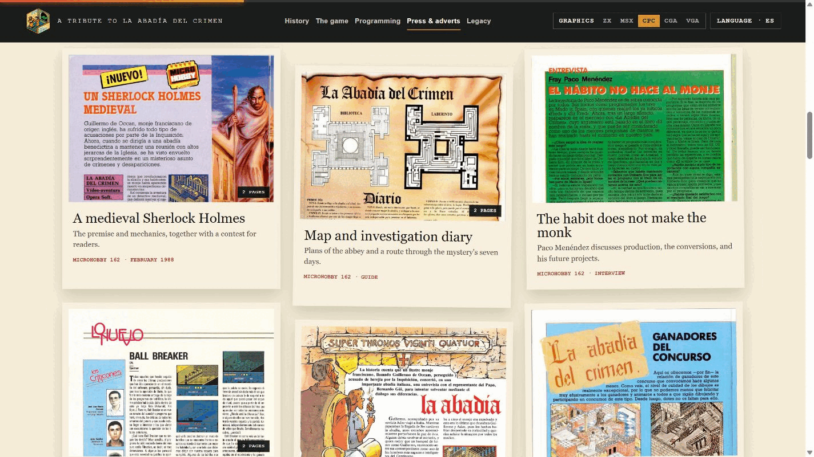

# Homenaje a La Abadía del Crimen

Archivo visual bilingüe e interactivo dedicado al clásico de Paco Menéndez y Juan Delcán.

A bilingual, interactive visual archive devoted to the classic game by Paco Menéndez and Juan Delcán.

**[Español](#español) · [English](#english) · [Abrir el homenaje / Open the tribute](https://andresdelcampo.github.io/HomenajeLaAbadiaDelCrimen/)**


## Español

Este homenaje recorre la historia, los personajes y la arquitectura de *La Abadía del Crimen*, junto con sus siete jornadas, versiones, objetos, sonido, apariciones en prensa, desarrollo técnico y legado.

La experiencia está construida como un archivo editorial de cinco rutas —Historia, El juego, Programación, Prensa y anuncios, y Legado— conectadas por una navegación persistente. Incluye expedientes interactivos, control de spoilers, cartografía, comparaciones visuales entre plataformas, audio preservado y una selección de páginas históricas que pueden abrirse y examinarse con controles de zoom dentro del propio sitio.

La presentación utiliza los gráficos originales de CPC 6128 por defecto y permite elegir desde la cabecera las ediciones visuales CPC, ZX Spectrum, MSX, PC CGA y remake PC VGA a 256 colores. La elección se conserva entre rutas y transforma los elementos vinculados —pantallas, personajes, objetos e indicador de Obsequium—. El recorrido histórico incorpora un expediente sobre los creadores y las adaptaciones, mientras que el archivo de prensa reúne ahora las dos entregas de *Retro Gamer España* dedicadas a Paco Menéndez (números 40 y 41), junto con la recepción británica y la prensa original.



### Contenido destacado

- Ocho personajes con agendas, relaciones y estados internos.
- Los siete días de la investigación, con protección frente a spoilers.
- Mapas interactivos y reconstrucciones realizadas con pantallas del juego.
- Cinco ediciones visuales seleccionables que acompañan la lectura entre rutas.
- Expediente de Paco Menéndez, Juan Delcán, las adaptaciones y la compleja cronología editorial.
- Prensa española y británica, publicidad, sonido, objetos y arqueología del código.
- Ediciones completas e independientes en español e inglés.

## English

This tribute explores the history, characters, and architecture of *La Abadía del Crimen*, together with its seven-day mystery, versions, objects, sound, contemporary press coverage, technical construction, and legacy.

The experience is designed as an editorial archive with five routes—History, The game, Programming, Press & adverts, and Legacy—connected by persistent navigation. It includes interactive dossiers, spoiler controls, cartography, visual platform comparisons, preserved audio, and a curated selection of historical pages that can be opened and examined with zoom controls inside the site itself.

Presentation defaults to the original CPC 6128 graphics, while a header control offers CPC, ZX Spectrum, MSX, PC CGA, and the 256-colour PC VGA remake. The choice persists between routes and transforms linked material—screens, characters, objects, and the Obsequium display. The history route now includes a builders and adaptations dossier, while the press archive brings together both *Retro Gamer España* features on Paco Menéndez (issues 40 and 41), the British rediscovery, and original coverage.



### Highlights

- Eight characters with schedules, relationships, and internal states.
- All seven days of the investigation, with spoiler protection.
- Interactive maps and reconstructions assembled from game screens.
- Five selectable visual editions that accompany the reader between routes.
- A dossier on Paco Menéndez, Juan Delcán, the adaptations, and the complex publishing timeline.
- Spanish and British press, advertising, sound, objects, and code archaeology.
- Complete, independent Spanish and English editions.

## Abrir localmente / Run locally

El sitio es completamente estático. Desde la raíz del repositorio:

The site is entirely static. From the repository root:

```powershell
python -m http.server 8765 --bind 127.0.0.1
```

Abre / Open: `http://127.0.0.1:8765/`

No requiere instalación, compilación, base de datos ni servicios externos.

No installation, build step, database, or external service is required.

## Derechos y créditos / Rights and credits

**Autor / Author:** Andrés del Campo Novales with GPT 5.6 Sol

**Revisión técnica / Technical review:** Rafael Corrales Pulido · Manuel Pazos · Jesús Martínez del Vas · José Manuel Braña Álvarez

Homenaje cultural no oficial y sin fines comerciales. Las fuentes y los créditos detallados figuran al final de ambas ediciones. Los gráficos del juego, capturas, páginas de revista, mapas, audio, marcas y demás materiales de terceros pertenecen a sus respectivos titulares y no quedan sometidos a una licencia general del repositorio.

Unofficial, non-commercial cultural tribute. Detailed sources and credits appear at the end of both editions. Game graphics, screenshots, magazine pages, maps, audio, trademarks, and other third-party materials remain the property of their respective rights holders and are not covered by a repository-wide license.

Consulta / See [RIGHTS.md](RIGHTS.md).
